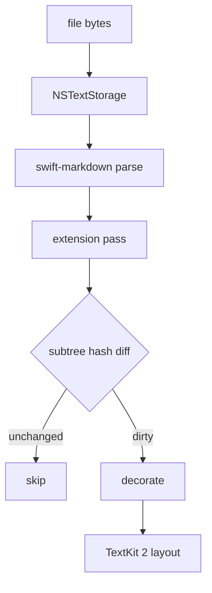
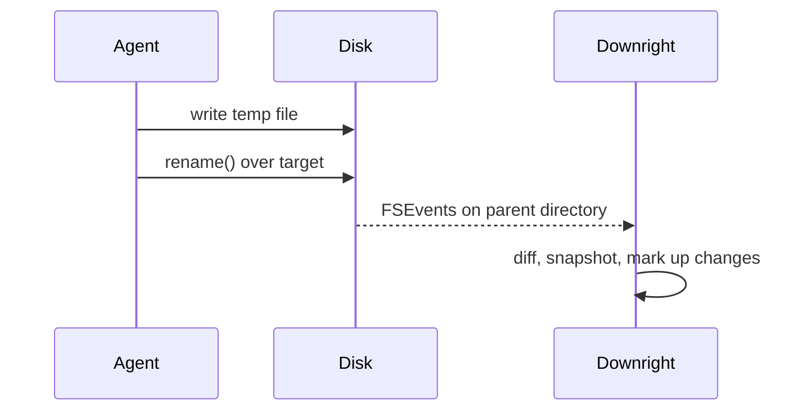

# Downright Sample Document

This file exercises every renderer path in the app. Open it to sanity-check a
build, or point Quick Look at it to compare the extension against the app.

## Prose and inline elements

Body text sets at a **capped measure** so lines stay readable, with _emphasis_,
***both at once***, ~~strikethrough~~, `inline code`, and a [link to the
spec](../markdown-app-spec.md). Reference links work too, like [this one][ref],
as do footnotes[^1] and autolinks such as <https://example.com>.

A wikilink renders as a link without becoming a vault: [[sample]] and
[[sample|with a label]].

[ref]: https://example.com "Reference link title"
[^1]: Footnotes resolve in a hover popover rather than sending you to the
      bottom of the document.

## Path tokens

The extension pass finds paths and resolves them against the document directory
and then the nearest git root. These exist:

- `Package.swift` — the package manifest
- `Sources/MarkdownCore/Model.swift:1` — with a line number
- `Scripts/bundle-app.sh`

These do not, and get a dotted red underline:

- `src/auth/session.ts:42`
- `Sources/MarkdownCore/Imaginary.swift`

That second list is the point. A completion summary claiming to have touched
files that aren't there says so on its face.

## Callouts

> [!NOTE]
> Agents emit these constantly, so they get a real treatment: a coloured left
> rule and an icon, never a filled box.

> [!WARNING] Watch the directory, not the inode
> Every agent CLI writes atomically — temp file, then `rename()`. A vnode watch
> on the original inode silently stops firing.

> [!TIP]
> Press `4` for the skeleton zoom level: every heading plus the first sentence
> of each section plus every code block, table, and task list.

## Tasks

- [x] Prove the no-mutation decoration model
- [x] Render core and Read mode
- [x] Ship the Quick Look extension
- [x] Notarise and publish
  - [ ] Sparkle appcast
  - [x] Ad-hoc signing for local runs

## Code

```swift
/// Raw text is the only source of truth (§3.1).
func decorate(_ storage: NSTextStorage, document: ParsedDocument) {
    let markers = hiddenRanges(document: document, caret: nil, selections: [])
    for range in markers {
        storage.addAttribute(.drHidden, value: true, range: range)
    }
    assert(storage.string == document.text, "decoration must never mutate characters")
}
```

```python
def subtree_hash(node: Node) -> int:
    """Full reparse, incremental restyle (§3.5)."""
    h = FNV_OFFSET
    for part in (node.kind, node.text, *(subtree_hash(c) for c in node.children)):
        h = (h ^ hash(part)) * FNV_PRIME
    return h & 0xFFFFFFFFFFFFFFFF
```

```diff
- watch the file
+ watch the parent directory and match on filename
```

```
A fence with no language hint still renders, and Tidy Document offers to guess
one for it.
```

## Tables

| Mode | Insertion caret | Markers | Purpose |
|---|---|---|---|
| Read | none | fully hidden | Reading, navigating, restructuring |
| Live | yes | hidden except at caret | Writing and editing |
| Source | yes | all visible, highlighted | Debugging the markdown itself |

Numeric columns right-align on their own:

| Metric | Target | Measured |
|:---|---:|---:|
| Cold launch to first pixel | 250 | 180 |
| Keystroke to render, p95 | 8 | 3 |
| Quick Look peak memory | 60 | 41 |

## Math

Inline math sits optically against the body text: $e^{i\pi} + 1 = 0$ and
$\sum_{k=1}^{n} k = \frac{n(n+1)}{2}$.

Block math centres in place:

$$
\frac{\partial}{\partial t}\Psi(x,t) = \frac{i\hbar}{2m}\nabla^2\Psi(x,t)
$$

Shell snippets must not be mistaken for math: `echo $PATH` and `$1` and
`$(git rev-parse --show-toplevel)` are all left alone.

## Diagrams





## Structure for the density gutter

### A deeper heading

Content under an H3, so the outline has something to indent and the breadcrumb
has a third level to show.

#### And an H4

Agents jump H2 → H4 constantly. Tidy Document normalises that.

## Long section for scroll testing

Reading position persists per file regardless of whether the bytes changed, so
long documents behave like books. This paragraph exists to give the scroll
anchor something to land in the middle of.

The density gutter shows the whole shape of a document at a glance: headings
indented by level, code blocks, tables, math, task lists, search matches, and —
most importantly — changed regions.

---

*Rendered by Downright.*
