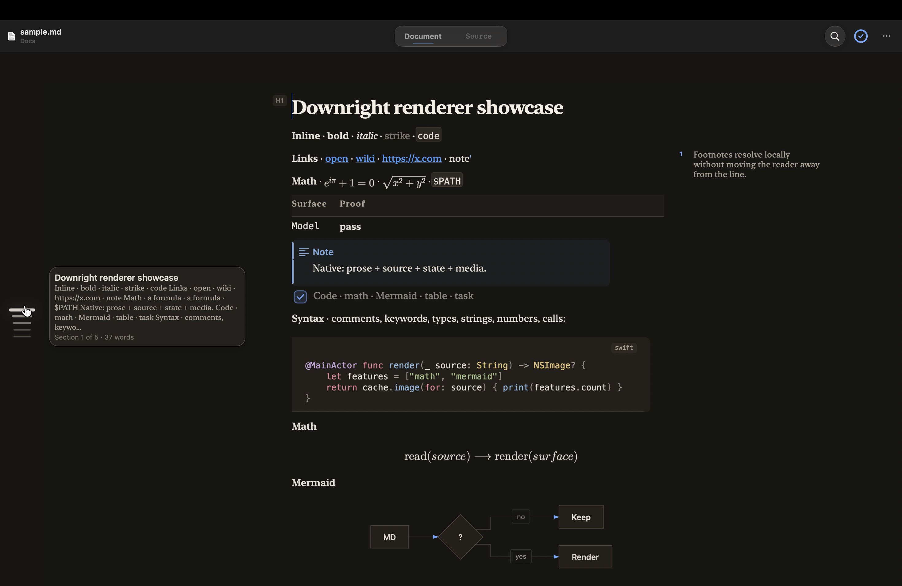

<p align="center">
  
</p>

<h1 align="center">Downright</h1>

<p align="center">
  A fast, native Markdown reader and editor for macOS.<br>
  Built for files that people and coding agents change together.
</p>

<p align="center"><strong>macOS 14+ · Swift 6 · Native AppKit · MIT</strong></p>

<p align="center">
  <a href="https://github.com/ezzy1630/Downright/actions/workflows/ci.yml"></a>
  <a href="https://github.com/ezzy1630/Downright/releases"></a>
  <a href="LICENSE"></a>
</p>

<p align="center"><a href="https://downright.cc/download/">Download the signed macOS release</a> · <a href="https://downright.cc/">downright.cc</a> · <a href="https://github.com/ezzy1630/homebrew-downright">Public Homebrew tap</a></p>

---

<p align="center">
  
</p>

Downright opens Markdown as a calm document, keeps its source exact, and shows
external edits without pulling you out of the page. It works offline, has no
account requirement, and never uses a WebView.

## Highlights

| Read and edit | Review agent output |
|---|---|
| Native CommonMark/GFM rendering | Live external-change tracking |
| One adaptive rendered/source surface with stable selection and scroll | Word-level rendered diffs and conflict safety |
| Math, Mermaid, tables, tasks, callouts, front matter, and images | Local snapshots, version timeline, and undoable task edits |
| Liquid-glass Find and Tasks panels | Outline, structural zoom, and density navigation |

| Work with the whole folder | Use Markdown everywhere |
|---|---|
| Optional folder workspace and sibling-file search without a vault | Quick Look previews and Finder thumbnails |
| Clickable `file.swift:42` references and editor handoff | `down` and `md` terminal commands |
| Themes that follow macOS Light/Dark mode | HTML/PDF export, Services, Spotlight metadata, and App Intents |
| First-run setup for app association, CLI, and Quick Look | Optional on-device Apple Intelligence |

Supported files: `.md`, `.markdown`, `.mdown`, `.mkd`, `.mdx`, `.mdc`, `.qmd`,
and `.rmd`.

## Why Downright

- **Exact source.** Rendering decorates the original text storage; it does not
  rebuild or normalize the document.
- **Safe live updates.** External writes refresh in place while preserving the
  reading position. Dirty local edits are never silently replaced.
- **Native and file-first.** TextKit 2, Core Text, SwiftMath, and native Mermaid
  rendering keep the app and Quick Look extensions lean. Open one file with no
  workspace setup, database, sync service, plugin runtime, or chat panel.

## Quick start

Requirements: macOS 14 or newer and a Swift 6 toolchain.

Clone, build the complete app, and install it with Finder integration:

```bash
git clone https://github.com/ezzy1630/Downright.git
cd Downright
Scripts/bundle-xcode-app.sh
APP_SOURCE=.build-xcode/Build/Products/Release/Downright.app Scripts/install.sh
down README.md
```

This path requires Xcode and `xcodegen`; it embeds both the Quick Look preview
and Finder thumbnail extensions. Launch Downright once after installation: the
first-run setup offers default-app and CLI registration, registers Quick Look,
and can repeat every step later under **Settings → General → System
integration**. See [Quick Look](Docs/QUICKLOOK.md) and [Release](Docs/RELEASE.md)
for details.

## Install with Homebrew

The public tap installs the same production app into `/Applications`:

```bash
brew tap ezzy1630/downright && brew trust --cask ezzy1630/downright/downright && brew install --cask downright
```

The app keeps its Sparkle updater after a cask install. GitHub records the DMG
request in the release asset download count.

This is the developer tap. The tap-free `brew install --cask downright`
command is not advertised until an official Homebrew Cask is accepted.

## Install with curl or npm

The simplest install command downloads the latest signed main-channel build, verifies its
published checksum and app signature, installs it into `/Applications`,
registers the Finder integrations, and links `down` and `md` when possible:

```bash
curl -fsSL https://downright.cc/install | bash
```

If Node.js 18 or newer is already installed, the npm launcher runs that same
first-party installer:

```bash
npx --yes downright-installer
```

Both paths leave Sparkle updates enabled in the installed app. Every subsequent
verified push to `main` becomes the next Sparkle update; feature-branch pushes
never reach users. The curl path
needs no Node.js; the npm path is macOS-only and requires Node.js 18+.

For a faster SwiftPM development build without Finder extensions:

```bash
Scripts/bundle-app.sh
open .build-main/bundle/Downright.app
```

## Everyday commands

```bash
down PLAN.md                              # open a file
down open --line 42 --review PLAN.md      # open an agent plan at a line for review
down open --reveal PLAN.md                # reveal a document in Finder
printf '# Draft\n' | down                 # open piped Markdown
down read --json README.md                # inspect without launching the app
down outline --json README.md             # emit document structure
down export --format html -o out.html README.md
down check --target github Docs/sample.md # validate a render target
down doctor                               # diagnose app, CLI, Quick Look, and updater setup
```

`md` is installed as an alias for `down`. `down doctor --json` emits a
machine-readable support report without modifying the machine; use
`down doctor --app path/to/Downright.app` to inspect a development bundle.
Run
`down --help` for every command.

## Keyboard essentials

All bindings are editable in **Settings → Keys**.

| Shortcut | Action | Shortcut | Action |
|---|---|---|---|
| `⌘F` | Find | `⌘E` | Find selected text |
| `⌘⇧F` | Search sibling files | `⌘⇧E` | Source Focus |
| `⌥⌘1`–`6` | Set heading level | `⌥⌘0` | Convert heading to body |
| `⌘[` / `⌘]` | Promote / demote heading | `⌘⇧K` | Command palette |
| `⌥⇧⌘3` | Task worklist | `⌥⌘V` | Version timeline |
| `⌃⌥⌘1`–`5` | Structural zoom | `⌥⇧↑` / `↓` | Previous / next change |
| `⌘\` | Split view | `⌘L` | Toggle task at caret |

## Themes and appearance

Downright follows macOS Light/Dark appearance by default. Light and dark
palettes are chosen separately under **Settings → Appearance** or
**View → Theme**. Turning off **Follow macOS Appearance** deliberately keeps
the selected light palette active.

Six themes ship with the app. VS Code and Shiki themes can be imported, and
custom JSON themes hot-reload from:

```text
~/Library/Application Support/Downright/Themes/
```

## Architecture

```text
MarkdownCore     parsing, extensions, AST diff
MarkdownRender   native decoration and layout
DownrightApp     windows, commands, panels, file watching
DownrightQL      Quick Look preview
DownrightThumb   Finder thumbnails
DownrightSpotlightMetadata  shared unopened-file metadata extraction
DownrightSpotlightImporter  macOS filesystem Spotlight importer
drdownright      shared CLI and integration support
down             terminal entry point
```

The core rule is simple: raw text remains the source of truth. One `NSTextView`
moves between rendered editing, scoped source, and full Source Focus while
preserving selection, undo, and byte fidelity.

More detail: [Architecture](Docs/ARCHITECTURE.md) ·
[Feature matrix](Docs/FEATURE-MATRIX.md) · [Performance](Docs/PERFORMANCE.md)

## Test and verify

Use the repository gate instead of bare `swift test`:

```bash
Scripts/check.sh
```

It builds every package target, verifies versions and dependencies, runs the
test suites, checks theme contrast, and exercises the benchmark. Release
performance budgets can be enforced with:

```bash
RUN_DRBENCH=1 Scripts/check.sh
```

Bundle verification:

```bash
Scripts/verify-bundle.sh .build-main/bundle/Downright.app
Scripts/check-app.sh
```

## Privacy

Opening, reading, editing, searching, diffing, and exporting are local. No
account or telemetry is required. Optional Apple Intelligence actions are
on-device, off by default, and receive only text selected by the user.

See [Privacy](Docs/PRIVACY.md).

## Project status

The current rolling release is tracked in [GitHub Releases](https://github.com/ezzy1630/Downright/releases); current polish is tracked under
[Unreleased](CHANGELOG.md). The repository contains the app, CLI, Quick Look,
updater, signing, notarization, DMG, and release automation. See [Status](Docs/STATUS.md)
for known gaps and implementation notes.

## License

Downright is available under the [MIT License](LICENSE). Vendored components
retain their own license files and notices.
