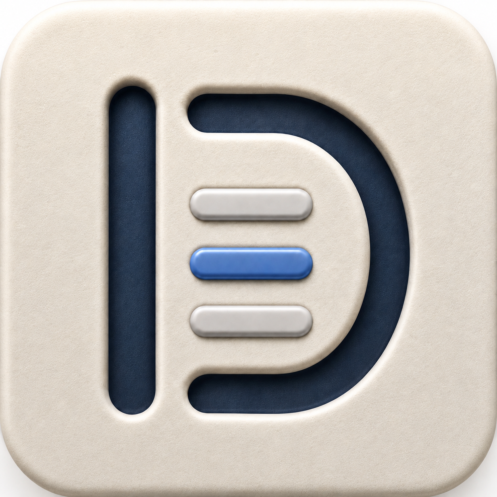

# Liquid glass background

The panel sits over all three busy surfaces below.

```swift
let material = NSGlassEffectView()
material.style = .regular
material.tintColor = background.withAlphaComponent(0.15)
```

| Surface | Expected read | Result |
|---|---|---|
| Syntax | Coloured wash, no readable words | Pending |
| Table | Soft geometry, no hard text | Pending |
| Image | Recognisable light and colour | Pending |



- [x] Keep the source bytes stable
- [ ] Check the frosted material
- [ ] Record the arrival
